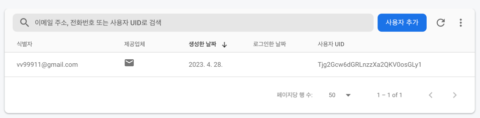
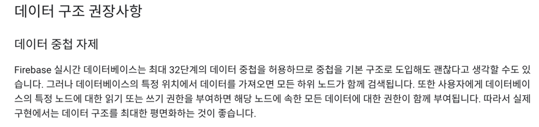

# BeomChat

- Firebase 사용해보기

## Firebase

- Firebase는 Google이 제공하는 클라우드 기반의 개발 플랫폼으로, 안드로이드, iOS, 웹 어플리케이션 개발에 사용된다.
- Firebase는 개발자들이 빠르게 애플리케이션을 구축하고, 성능을 개선하며, 사용자를 관리하고 사용자 경험을 분석할 수 있도록 다양한 기능을 제공한다.

### 주요 기능

1. **실시간 데이터베이스(Realtime Database)**: 클라우드에 호스팅되는 NoSQL 데이터베이스로 실시간으로 데이터를 동기화하며 오프라인에서도 작동한다.
2. **인증(Authentication)**: 이메일, 비밀번호, 소셜 미디어 계정, 전화번호 등을 통해 사용자 인증을 쉽게 구현할 수 있다.
3. **클라우드 메시징(Cloud Messaging)**: 무료로 푸시 알림을 보낼 수 있는 서비스를 제공
4. 스토리지(Storage): 이미지, 동영상, 파일 등의 콘텐츠를 안전하게 저장하고 관리할 수 있는 클라우드 저장소.
5. 호스팅(Hosting): 웹 앱에 대한 정적 및 동적 호스팅을 제공한다.
6. 원격 구성(Remote Config): 앱의 동작과 모양을 원격으로 변경할 수 있는 기능.
7. 테스트 랩(Test Lab): 다양한 기기 및 환경에서 앱을 테스트할 수 있게 한다.
8. Crashlytics: 앱의 실시간 충돌 보고 및 분석을 제공한다.
9. Google Analytics: 사용자 행동 분석을 위한 데이터를 수집 및 처리한다.
10. Performance Monitoring: 앱의 성능 문제를 감지하고 개선할 수 있도록 도와주는 도구.

## Firebase Realtime Database

데이터를 JSON 형식으로 저장하고 실시간으로 동기화할 수 있다.

- 실시간 동기화: 데이터를 즉시 동기화하여 모든 연결된 클라이언트에 변경 사항이 전달된다. 이로 인해 쉽게 실시간 기능을 구현할 수 있다.
- 오프라인 지원: 클라이언트가 오프라인 상태로 전환되더라도 로컬 캐시를 이용해 데이터를 저장하고 변경 사항을 추적할 수 있다. 네트워크 연결이 복구되면 변경 사항이 서버와
  동기화된다.
- 데이터 보안: Realtime Database는 사용자 인증 및 데이터 엑세스 권한 관리를 지원한다. 이를 통해 개발자들은 애플리케이션의 데이터에 대한 접근 권한을 세밀하게
  제어할 수 있다.
- 확장성: 데이터베이스는 자동으로 확장되어 애플리케이션의 성장에 따라 요구되는 처리량을 충족시킨다.

### 예시



```json
{
  "User": {
    "Tjg2Gcw6dGRLnzzXa2QKV0osGLy1": {
      "userId": "Tjg2Gcw6dGRLnzzXa2QKV0osGLy1",
      "username": "BeomSeok",
      "description": "밥먹고 코딩만 함"
    },
    "TRWurHUhBzRVQo2usvAE8g6we4y1": {
      "userId": "TRWurHUhBzRVQo2usvAE8g6we4y1",
      "username": "BeomSeok2",
      "description": "밥먹고 코딩 많이 함"
    }
  },  // ChatRoom/$uid
  "ChatRoom": {
    "Tjg2Gcw6dGRLnzzXa2QKV0osGLy1": {
      "userBId": {
        "chatRoomId": "String",
        "lastMessage": "lastMessage",
        "otherUserId": "TRWurHUhBzRVQo2usvAE8g6we4y1",
        "otherUserName": "BeomSeok2"
      },
      "TRWurHUhBzRVQo2usvAE8g6we4y1": {
        "chatRoomId": "String",
        "lastMessage": "lastMessage",
        "otherUserId": "TRWurHUhBzRVQo2usvAE8g6we4y1",
        "otherUserName": "BeomSeok2"
      },
      "TRWurHUhBzRVQo2usvAE8g6we4y1": {
        "chatRoomId": "String",
        "lastMessage": "lastMessage",
        "otherUserId": "TRWurHUhBzRVQo2usvAE8g6we4y1",
        "otherUserName": "BeomSeok2"
      }
    }
  },
  "Chat": { // Chat/$chatRoomId
    "채팅방 id": {
      "메시지 id": {
        "chatId": "String",
        "message": "String",
        "userId": "String"
      },
      "메시지 id": {
        "chatId": "String",
        "message": "String",
        "userId": "String"
      },
      "메시지 id": {
        "chatId": "String",
        "message": "String",
        "userId": "String"
      },
      "메시지 id": {
        "chatId": "String",
        "message": "String",
        "userId": "String"
      }
    },
    "채팅방 id": {
      "메시지 id": {
        "chatId": "String",
        "message": "String",
        "userId": "String"
      }
    }
  }
}
```

- Firebase Docs에서는 데이터 구조에 대해 어떻게 다루는 것이 좋을 것인지에 대해 언급되어 있다.


https://firebase.google.com/docs/database/android/structure-data?hl=ko&authuser=0

#### 데이터 구조 평면화

- 데이터 구조 평면화(Flattening data structure)은 데이터베이스의 구조를 단순화하고 효율적으로 관리할 수 있게 하는 최적화 기법이다. 데이터 구조 평면화는
  중첩된 데이터를 최소화하고, 더 쉽게 쿼리할 수 있는 형태로 데이터를 재구성하는 것을 목표로 한다.

특히 파이어베이스와 같은 NoSQL 데이터베이스에서 데이터 구조 평면화가 매우 중요하다.

1. 중첩된 데이터를 읽을 때 오버페치(over-fetch)문제가 발생할 수 있기 때문이다. Realtime Database에서 한 번에 가져올 수 있는 데이터는 최상위 노드에
   대한 요청을 기준으로 한다. 따라서 중첩된 데이터가 많으면 필요하지 않은 데이터까지 가져오게 되어 비효율적일 수 있다.
2. 중첩된 데이터를 업데이트 할 때, 원치 않은 변경이 발생할 수 있다. 중첩된 데이터를 수정하려면 상위 노드의 전체 데이터를 덮어써야 하므로, 데이터의 실수로 인한 손실이
   발생할 수 있다.
3. 데이터 구조가 복잡해지면 쿼리하기가 어려워지는 문제도 있다. 중첩된 데이터가 많으면 특정 데이터에 접근하거나 필터링하는 데 더 많은 시간과 노력이 들게 될 것이다.

데이터 구조 평면화를 하고, 평면화된 데이터 구조를 사용함으로써 다음의 이점을 가져갈 수 있다.

1. 핑요한 데이터만 쉽게 가져오기. 각 데이터 항목이 별도의 노드에 저장되므로, 필요한 데이터만 선택적으로 가져온다.
2. 데이터 변경이 더 안전해진다. 각 데이터 항목이 별도의 노드에 저장되므로, 특정 데이터를 업데이트하더라도 다른 데이터에 영향을 미치지 않는다.
3. 쿼리 성승이 향상된다. 데이터 구조가 단순해지므로, 데이터에 접근하고 필터링하는 데 걸리는 시간이 줄어든다.

데이터 구조 평면화를 적용할 때 고려해야할 사항은 다음과 같다.

- 중첩을 최소화하고, 각 데이터 항목을 별도의 노드에 저장하기
- 데이터 항목 간의 관계를 표현하기 위해 인덱스를 사용하기
- 데이터를 조회할 때 필요한 경우 여러 노드를 조인하여 원하는 정보를 얻을 수 있다.

#### 데이터 구조 평면화 예시

- **중첩된 데이터 구조**

```json
{
  "posts": {
    "post1": {
      "title": "Hello World!",
      "author": "user1",
      "comments": {
        "comment1": {
          "text": "Nice post!",
          "author": "user2"
        },
        "comment2": {
          "text": "Thanks for sharing!",
          "author": "user3"
        }
      }
    }
  }
}
```

- **평면화된 데이터 구조**

```json
{
  "posts": {
    "post1": {
      "title": "Hello World!",
      "author": "user1"
    }
  },
  "comments": {
    "comment1": {
      "text": "Nice post!",
      "author": "user2",
      "post": "post1"
    },
    "comment2": {
      "text": "Thanks for sharing!",
      "author": "user3",
      "post": "post1"
    }
  }
}
```

평면화된 구조에서는 댓글 정보가 별도의 노드(comments)에 저장되어 있으며, 각 댓글은 해당 게시물(post)을 참조하고 있다. 이렇게 함으로써 개별 게시물이나 댓글에 더
쉽게 접근할 수 있으며, 효율적인 데이터 관리가 가능해진다.

#### Model

```kotlin
data class User(
    val name: String? = null,
    val age: Int? = null
)
```

#### Data 저장

```kotlin
import com.google.firebase.database.FirebaseDatabase

// ...

val database = FirebaseDatabase.getInstance()
val usersRef = database.getReference("users")

fun saveUser() {
    val userId = usersRef.push().key // 새로운 고유한 키 생성
    val user = User("BeomSeok Yi", 25)

    if (userId != null) {
        usersRef.child(userId).setValue(user)
            .addOnSuccessListener {
                // 데이터 저장 성공
            }
            .addOnFailureListener { exception ->
                // 데이터 저장 실패
                exception.printStackTrace()
            }
    }
}
```

## Firebase Authentication

https://firebase.google.com/docs/auth/android/password-auth?hl=ko&authuser=0

```kotlin
binding.signInButton.setOnClickListener {
    val email = binding.emailEditText.text.toString()
    val password = binding.passwordEditText.text.toString()

    if (email.isEmpty() || password.isEmpty()) {
        Toast.makeText(this, R.string.email_or_password_not_input, Toast.LENGTH_SHORT)
            .show()
        return@setOnClickListener
    }

    Firebase.auth.signInWithEmailAndPassword(email, password)
        .addOnCompleteListener { task ->
            if (task.isSuccessful) {
                val intent = Intent(this, MainActivity::class.java)
                startActivity(intent)
                finish()
            } else {
                Log.e("SignInActitivy", task.exception.toString())
                Toast.makeText(this, R.string.fail_sign_in, Toast.LENGTH_SHORT).show()
            }
        }
}
binding.signUpButton.setOnClickListener {
    val email = binding.emailEditText.text.toString()
    val password = binding.passwordEditText.text.toString()

    if (email.isEmpty() || password.isEmpty()) {
        Toast.makeText(this, R.string.email_or_password_not_input, Toast.LENGTH_SHORT)
            .show()
        return@setOnClickListener
    }

    Firebase.auth.createUserWithEmailAndPassword(email, password)
        .addOnCompleteListener(this) { task ->
            if (task.isSuccessful) {
                // 회원가입 성공
                Toast.makeText(this, R.string.successful_sign_up, Toast.LENGTH_SHORT)
                    .show()
            } else {
                Toast.makeText(this, R.string.fail_sign_up, Toast.LENGTH_SHORT).show()
            }
        }
}
```

## Firebase cloud Message (FCM)